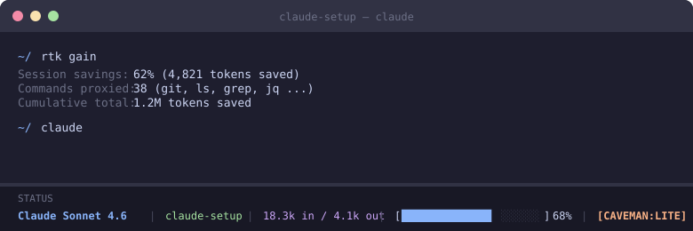

# Claude Code Setup



Replication guide for the full Claude Code environment on a fresh machine. Assumes Claude Code CLI is already installed (`claude --version` works).

---

## Files to Copy

The core config lives in `~/.claude/`. All files are versioned in the [`claude-config/`](claude-config/) directory of this repo.

| Repo Path | Destination | Purpose |
|---|---|---|
| `claude-config/CLAUDE.md` | `~/.claude/CLAUDE.md` | Global behavior instructions loaded into every session |
| `claude-config/RTK.md` | `~/.claude/RTK.md` | RTK reference doc, imported via `@RTK.md` in CLAUDE.md |
| `claude-config/settings.json` | `~/.claude/settings.json` | Permissions, model, hooks, plugins, statusline |
| `claude-config/statusline-command.sh` | `~/.claude/statusline-command.sh` | Custom statusline script (model, context %, token counts, caveman mode) |
| `claude-config/hooks/track-output-tokens.sh` | `~/.claude/hooks/track-output-tokens.sh` | Stop hook — writes output token count to `.session-out-tokens.json` for the statusline |
| `claude-config/hooks/validate-bash.sh` | `~/.claude/hooks/validate-bash.sh` | PreToolUse hook — blocks `rm -rf /`, `git push --force`, `git add -A`, and `sudo` |

Copy them into place:

```bash
cp claude-config/CLAUDE.md claude-config/RTK.md claude-config/settings.json claude-config/statusline-command.sh ~/.claude/
mkdir -p ~/.claude/hooks
cp claude-config/hooks/*.sh ~/.claude/hooks/
chmod +x ~/.claude/hooks/*.sh ~/.claude/statusline-command.sh
```

---

## Plugins

Claude Code plugins extend the CLI with new slash commands and capabilities. The `settings.json` in this repo already includes the `extraKnownMarketplaces` and `enabledPlugins` entries needed -- copy it into `~/.claude/` first, then install each plugin from within Claude Code.

### Custom Marketplaces

Three non-default marketplaces must be registered before their plugins can be installed. These are already wired in `claude-config/settings.json`:

| Marketplace Key | Repo |
|---|---|
| `caveman` | `github:JuliusBrussee/caveman` |
| `bandwidth` | `github:Bandwidth/bw-agents` |
| `plugins-kit` | `git@github.com:kitaekatt/plugins-kit.git` (SSH) |

> `plugins-kit` requires SSH access to the private repo.

### Install Commands

Run these inside a Claude Code session:

```
/plugins install caveman@caveman
/plugins install bandwidth@bandwidth
/plugins install paas@bandwidth
/plugins install github@claude-plugins-official
/plugins install cache-kit@plugins-kit
/plugins install clangd-lsp@claude-plugins-official
/plugins install gopls-lsp@claude-plugins-official
```

### Plugin Reference

| Plugin | Marketplace | Purpose |
|---|---|---|
| `caveman` | `JuliusBrussee/caveman` | Token-efficient output compression; modes: `lite`, `full`, `ultra`, `wenyan-*`, `commit`, `review`, `compress` |
| `bandwidth` | `Bandwidth/bw-agents` | Bandwidth internal agent tools |
| `paas` | `Bandwidth/bw-agents` | Bandwidth PaaS tooling |
| `github` | `anthropics/claude-plugins-official` | GitHub PR/issue/review workflows |
| `cache-kit` | `kitaekatt/plugins-kit` | Prompt cache management utilities |
| `clangd-lsp` | `anthropics/claude-plugins-official` | C/C++ LSP integration via clangd |
| `gopls-lsp` | `anthropics/claude-plugins-official` | Go LSP integration via gopls |

---

## Key settings.json Config

### Hooks

Two hooks run on every session:

- **Stop** — `track-output-tokens.sh` captures output tokens so the statusline can display them
- **PreToolUse (Bash)** — `validate-bash.sh` blocks dangerous commands; `rtk hook claude` rewrites commands through RTK for token savings

### Plugins

Installed via the Claude Code plugin marketplace. Add these to `extraKnownMarketplaces` + `enabledPlugins`:

| Plugin | Marketplace Repo |
|---|---|
| `caveman@caveman` | `JuliusBrussee/caveman` |
| `bandwidth@bandwidth` | `Bandwidth/bw-agents` |
| `paas@bandwidth` | `Bandwidth/bw-agents` |
| `github@claude-plugins-official` | `anthropics/claude-plugins-official` |
| `cache-kit@plugins-kit` | `kitaekatt/plugins-kit` (SSH) |
| `clangd-lsp@claude-plugins-official` | `anthropics/claude-plugins-official` |
| `gopls-lsp@claude-plugins-official` | `anthropics/claude-plugins-official` |

---

## RTK Setup

RTK (Rust Token Killer) is a CLI proxy that routes commands through a filter before they reach Claude, reducing token consumption by 60-90% on common dev operations.

**Install:**

```bash
brew install getagentseal/tap/rtk
```

**Verify:**

```bash
rtk --version   # should print: rtk X.Y.Z
rtk gain        # shows token savings analytics
which rtk       # should be /opt/homebrew/bin/rtk
```

> Name collision warning: if `rtk gain` fails, you may have `reachingforthejack/rtk` (Rust Type Kit) installed instead. Uninstall it first.

**How it works:** The `PreToolUse` Bash hook rewrites every command transparently. `git status` becomes `rtk git status` with zero overhead to the model. See `RTK.md` for the full command reference.

**Meta commands (call rtk directly, not through Claude):**

```bash
rtk gain              # token savings analytics
rtk gain --history    # per-command usage history
rtk discover          # scan Claude history for missed opportunities
rtk proxy <cmd>       # run a command bypassing RTK filters (debug)
```

---

## Caveman Plugin Setup

Caveman compresses Claude's verbose output into token-efficient summaries. It runs as a Claude Code plugin.

**Install:** It is registered in `settings.json` under `extraKnownMarketplaces` pointing at `JuliusBrussee/caveman`. Run `/install caveman` inside Claude Code to activate.

**Modes:** `off`, `lite`, `full`, `ultra`, `wenyan-*`, `commit`, `review`, `compress`. The current mode is shown in the statusline as `[CAVEMAN:MODE]` (or `[CAVEMAN]` for full mode).

**Toggle:** `/caveman <mode>` from within Claude Code.

The statusline script reads `~/.claude/.caveman-active` to display the current mode.

---

## Custom Statusline

The statusline shows: `Model | Project | Tokens In / Tokens Out | [Context Bar] % | [CAVEMAN:MODE]`

**How it works:**

- `settings.json` sets `"statusLine": { "type": "command", "command": "bash ~/.claude/statusline-command.sh" }`
- The script reads the JSON piped from Claude Code and computes the display string
- Output token tracking requires the `track-output-tokens.sh` Stop hook to be active

**Dependencies:** `jq`, `awk`, `bash`

---

## MCP Servers

Three MCP servers are connected via the Claude desktop app (remote auth -- no local config required beyond signing in).

| Server | Type | Purpose |
|---|---|---|
| **claude.ai Slack** | Remote (OAuth) | Read channels/threads, send messages, search, manage canvases |
| **claude.ai Google Drive** | Remote (OAuth) | Read, search, create, and download Drive files |
| **Atlassian** | Remote (OAuth) | Jira issue management, Confluence page read/write/search |

**Setup:** These are authenticated through the Claude desktop app. Sign in to each service via `Settings > Integrations` in the Claude desktop app -- no manual config files needed. Once connected they are available in both the desktop app and Claude Code CLI sessions.

**Usage notes from CLAUDE.md:**
- Confluence (Atlassian) -- use for creating/editing/reading Confluence docs
- The `/create-jira` plugin handles Jira ticket creation

---

## Agent Skills

These two repos add useful slash-command skills to Claude Code:

**[mattpocock/skills](https://github.com/mattpocock/skills)** — A collection of Claude Code skills (slash commands) covering common workflows. Clone and reference in your project or global `.claude/` config.

**[OthmanAdi/planning-with-files](https://github.com/OthmanAdi/planning-with-files)** — Adds structured file-based planning to Claude Code sessions. Useful for long, multi-step tasks where you want Claude to maintain a plan document.

Install by cloning and adding the skills path to your Claude Code config, or dropping the `.md` skill files into `~/.claude/skills/`.

---

## Token Observability Tools

### CodeBurn

Fork: [github.com/slmingol/codeburn](https://github.com/slmingol/codeburn) | Upstream: [github.com/getagentseal/codeburn](https://github.com/getagentseal/codeburn)

TUI dashboard + macOS menu bar app. Tracks token usage, cost, and performance across 25+ AI coding tools (Claude Code, Cursor, Copilot, etc.). Reads session data directly from disk -- no proxy, no API keys, no signup.

```bash
npm install -g codeburn
codeburn
```

### TokenTelemetry

Fork: [github.com/slmingol/tokentelemetry](https://github.com/slmingol/tokentelemetry) | Upstream: [github.com/VasiHemanth/tokentelemetry](https://github.com/VasiHemanth/tokentelemetry) | [tokentelemetry.com](https://tokentelemetry.com)

Full-stack local observability dashboard. Covers token usage, LLM costs, tool call waterfalls, session traces, and reasoning steps across all major AI coding agents including Claude Code, Codex, Gemini CLI, Cursor, and Hermes Agent.

```bash
# macOS / Linux
curl -fsSL https://raw.githubusercontent.com/VasiHemanth/tokentelemetry/main/install.sh | bash

# Windows
irm https://raw.githubusercontent.com/VasiHemanth/tokentelemetry/main/install.ps1 | iex
```

100% local. No data leaves your machine.

---

## Minimal CLAUDE.md

The global `~/.claude/CLAUDE.md` sets baseline behavior for every project:

```markdown
## Approach
- Read existing files before writing. Don't re-read unless changed.
- Thorough in reasoning, concise in output.
- Skip files over 100KB unless required.
- No sycophantic openers or closing fluff.
- No emojis or em-dashes.
- Do not guess APIs, versions, flags, commit SHAs, or package names. Verify by reading code or docs before asserting.

## JIRA
- Use the /create-jira plugin to create JIRA tickets when asked

## MCP Tools
- Confluence (Atlassian) — use for creating/editing/reading Confluence docs.

@RTK.md
```

The `@RTK.md` import pulls in the RTK reference so Claude knows to use RTK meta commands directly and understands hook-based command rewriting.

---

## Quick Checklist

```
[ ] claude --version                          # Claude Code CLI installed
[ ] git clone https://github.com/slmingol/claude-setup
[ ] cp claude-config/CLAUDE.md claude-config/RTK.md claude-config/settings.json claude-config/statusline-command.sh ~/.claude/
[ ] mkdir -p ~/.claude/hooks
[ ] cp claude-config/hooks/*.sh ~/.claude/hooks/
[ ] chmod +x ~/.claude/hooks/*.sh ~/.claude/statusline-command.sh
[ ] brew install getagentseal/tap/rtk         # RTK
[ ] rtk --version                             # Verify RTK
# Authenticate MCP servers via Claude desktop app Settings > Integrations:
[ ] Sign in to Slack (claude.ai Slack)
[ ] Sign in to Google (claude.ai Google Drive)
[ ] Sign in to Atlassian (Jira + Confluence)
# Run the following inside a Claude Code session:
[ ] /plugins install caveman@caveman
[ ] /plugins install bandwidth@bandwidth
[ ] /plugins install paas@bandwidth
[ ] /plugins install github@claude-plugins-official
[ ] /plugins install cache-kit@plugins-kit    # requires SSH access to kitaekatt/plugins-kit
[ ] /plugins install clangd-lsp@claude-plugins-official
[ ] /plugins install gopls-lsp@claude-plugins-official
[ ] npm install -g codeburn                   # CodeBurn (optional)
[ ] tokentelemetry install                    # TokenTelemetry (optional)
```
